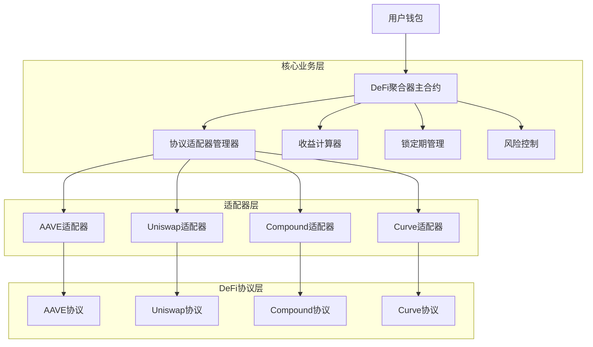
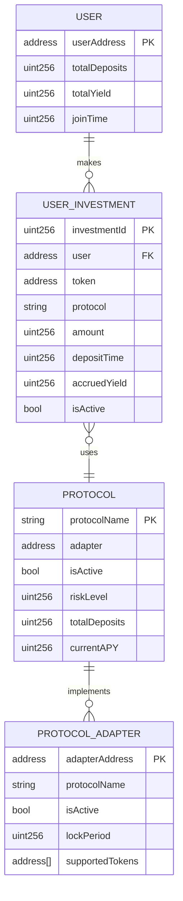
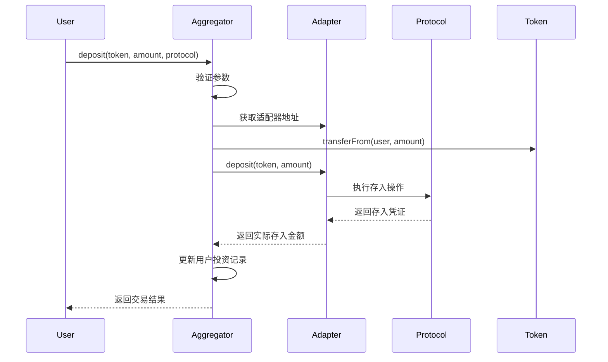
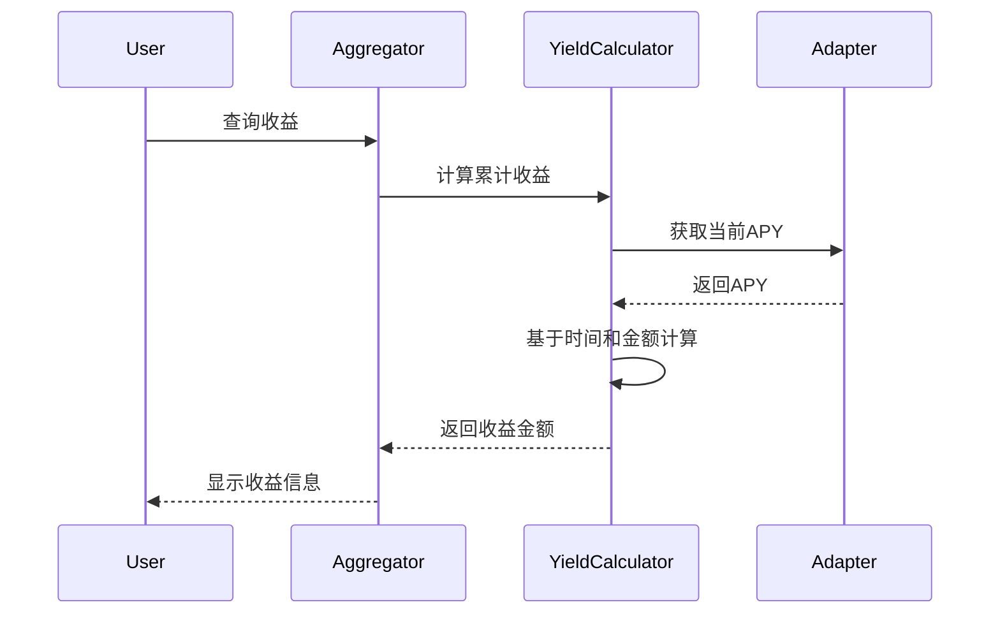

## 1. 架构设计

### 系统架构图


## 2. 技术描述

### 核心技术栈
- **智能合约平台**：Solidity ^0.8.0
- **开发框架**：Hardhat
- **测试框架**：Hardhat Network + Chai
- **代码质量**：Solhint + Prettier
- **依赖管理**：npm

### 合约架构组件
1. **DeFiAggregator.sol** - 主聚合器合约
2. **ProtocolAdapter.sol** - 适配器接口定义
3. **AaveAdapter.sol** - AAVE协议适配器
4. **UniswapAdapter.sol** - Uniswap协议适配器
5. **CompoundAdapter.sol** - Compound协议适配器
6. **CurveAdapter.sol** - Curve协议适配器
7. **YieldCalculator.sol** - 收益计算库
8. **LockManager.sol** - 锁定期管理库

## 3. 合约接口定义

### 主聚合器合约接口
```solidity
interface IDeFiAggregator {
    // 存入资金
    function deposit(address token, uint256 amount, string memory protocol) external;
    
    // 提取资金
    function withdraw(address token, uint256 amount, string memory protocol) external;
    
    // 查询用户余额
    function getUserBalance(address user, address token, string memory protocol) external view returns (uint256);
    
    // 查询当前APY
    function getCurrentAPY(string memory protocol) external view returns (uint256);
    
    // 查询可提取金额
    function getWithdrawableAmount(address user, address token, string memory protocol) external view returns (uint256);
}
```

### 协议适配器接口
```solidity
interface IProtocolAdapter {
    // 存入资金
    function deposit(address token, uint256 amount) external returns (uint256);
    
    // 提取资金
    function withdraw(address token, uint256 amount) external returns (uint256);
    
    // 查询用户余额
    function getBalance(address user, address token) external view returns (uint256);
    
    // 查询当前APY
    function getAPY() external view returns (uint256);
    
    // 获取锁定期（秒）
    function getLockPeriod() external view returns (uint256);
    
    // 获取协议名称
    function getProtocolName() external pure returns (string memory);
}
```

## 4. 数据模型

### 用户投资记录结构
```solidity
struct UserInvestment {
    address user;           // 用户地址
    address token;          // 代币地址
    string protocol;        // 协议名称
    uint256 amount;         // 投资金额
    uint256 depositTime;    // 存入时间
    uint256 lastUpdateTime; // 最后更新时间
    uint256 accruedYield;   // 累计收益
    bool isActive;         // 是否激活
}
```

### 协议信息结构
```solidity
struct ProtocolInfo {
    address adapter;        // 适配器合约地址
    bool isActive;         // 是否激活
    uint256 riskLevel;     // 风险等级 (1-5)
    uint256 totalDeposits; // 总存款量
    uint256 lastAPY;       // 最新APY
    uint256 updateTime;    // 更新时间
}
```

### 数据库关系图


## 5. 时序图

### 资金存入流程


### 收益计算流程


## 6. 安全机制

### 风险控制措施
1. **重入保护**：使用ReentrancyGuard防止重入攻击
2. **滑点保护**：设置最大滑点限制
3. **权限控制**：管理员权限分级管理
4. **紧急暂停**：支持紧急暂停合约功能
5. **审计日志**：记录所有重要操作

### 收益计算精度
- 使用高精度数学库处理小数计算
- 设置最小投资金额限制
- 定期更新APY数据
- 考虑复利计算机制

## 7. 部署配置

### 网络配置
```javascript
module.exports = {
  solidity: "0.8.19",
  networks: {
    mainnet: {
      url: process.env.MAINNET_URL,
      accounts: [process.env.PRIVATE_KEY]
    },
    polygon: {
      url: process.env.POLYGON_URL,
      accounts: [process.env.PRIVATE_KEY]
    },
    arbitrum: {
      url: process.env.ARBITRUM_URL,
      accounts: [process.env.PRIVATE_KEY]
    }
  }
}
```

### 支持的代币
- **稳定币**：USDC、USDT、DAI
- **主流币**：WETH、WBTC
- **生息代币**：aTokens、cTokens、LP代币