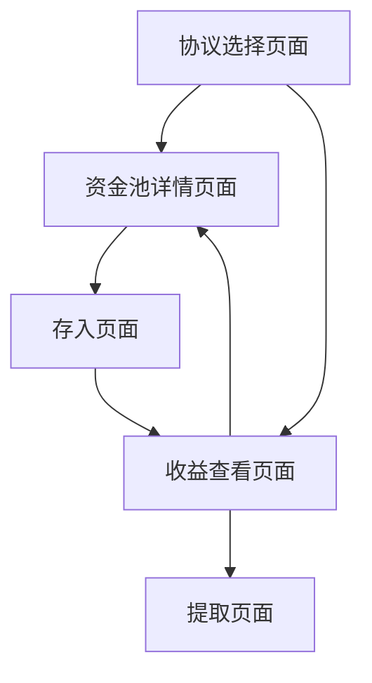

## 1. 产品概述
DeFi聚合器是一个智能合约平台，允许用户将资金存入不同的DeFi协议（AAVE、Uniswap、Compound、Curve）来获取收益。用户可以选择最优的收益率策略，系统会自动处理底层协议的交互和收益分配。

主要目标：为用户提供一站式DeFi收益聚合服务，简化多协议操作流程，优化收益策略。

## 2. 核心功能

### 2.1 用户角色
| 角色 | 注册方式 | 核心权限 |
|------|----------|----------|
| 普通用户 | 钱包连接 | 选择协议、存入资金、提取资金、查看收益 |
| 管理员 | 合约部署时设置 | 添加新协议、更新策略参数、紧急暂停 |

### 2.2 功能模块
DeFi聚合器包含以下主要功能模块：

1. **协议选择页面**：展示支持的DeFi协议列表、收益率对比、风险等级
2. **资金池详情页面**：显示具体资金池信息、历史收益、锁定期要求
3. **存入页面**：输入存入金额、选择协议、确认交易
4. **收益查看页面**：显示当前持仓、累计收益、可提取金额
5. **提取页面**：选择提取金额、确认解锁状态、执行提取

### 2.3 页面详情
| 页面名称 | 模块名称 | 功能描述 |
|-----------|-------------|---------------------|
| 协议选择页面 | 协议列表 | 展示AAVE、Uniswap、Compound、Curve的实时APY、总锁仓量、风险评级 |
| 协议选择页面 | 收益对比 | 显示各协议7天、30天、90天的历史收益率对比图表 |
| 资金池详情页面 | 池子信息 | 显示资金池地址、代币类型、当前APY、总存款量 |
| 资金池详情页面 | 风险指标 | 显示协议风险评分、智能合约审计状态、历史漏洞记录 |
| 存入页面 | 金额输入 | 输入要存入的代币数量，显示预估年化收益 |
| 存入页面 | 协议确认 | 显示选择的协议信息、交易费用预估、滑点设置 |
| 收益查看页面 | 持仓概览 | 显示各协议的存款分布、总持仓价值、累计收益 |
| 收益查看页面 | 收益详情 | 按协议展示收益明细、收益历史趋势图 |
| 提取页面 | 提取选择 | 选择要提取的协议和金额，显示解锁状态和剩余锁定期 |
| 提取页面 | 交易确认 | 确认提取交易，显示矿工费和到账预估时间 |

## 3. 核心流程

### 用户操作流程
1. 用户连接钱包进入协议选择页面
2. 浏览不同协议的收益率和风险指标
3. 选择目标协议并查看详细信息
4. 输入存入金额并确认交易
5. 系统通过适配器将资金存入对应协议
6. 用户可以实时查看收益情况
7. 锁定期结束后，用户可以申请提取资金
8. 系统通过适配器从协议中提取资金并返还用户

### 页面导航流程

## 4. 用户界面设计

### 4.1 设计风格
- **主色调**：深蓝色（#1E3A8A）代表金融稳定，绿色（#10B981）代表收益增长
- **按钮样式**：圆角矩形，悬停效果，主要操作用实心按钮
- **字体**：Inter字体，标题24px，正文16px，小字14px
- **布局风格**：卡片式布局，响应式网格系统
- **图标风格**：使用简洁的线性图标，表示不同DeFi协议

### 4.2 页面设计概述
| 页面名称 | 模块名称 | UI元素 |
|-----------|-------------|-------------|
| 协议选择页面 | 协议列表 | 卡片网格布局，每张卡片显示协议Logo、APY数值、风险星级 |
| 协议选择页面 | 收益对比 | 折线图显示历史收益率，支持时间筛选器 |
| 资金池详情页面 | 池子信息 | 顶部显示关键指标卡片，底部显示详细信息表格 |
| 存入页面 | 金额输入 | 大字体输入框，实时显示预估收益计算器 |
| 收益查看页面 | 持仓概览 | 饼图显示资产分布，卡片显示各协议收益情况 |
| 提取页面 | 提取选择 | 列表显示可提取资产，锁定期倒计时显示 |

### 4.3 响应式设计
- **桌面优先**：主要面向桌面端用户，支持大屏幕完整功能展示
- **移动端适配**：支持手机和平板访问，简化操作流程
- **触控优化**：按钮和输入框适配触控操作，支持手势滑动