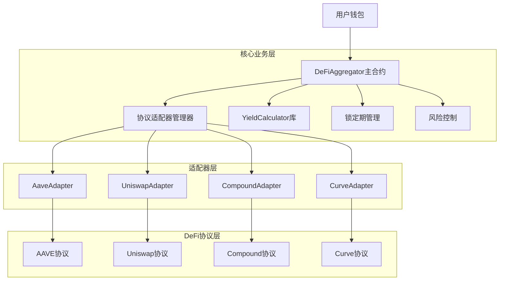
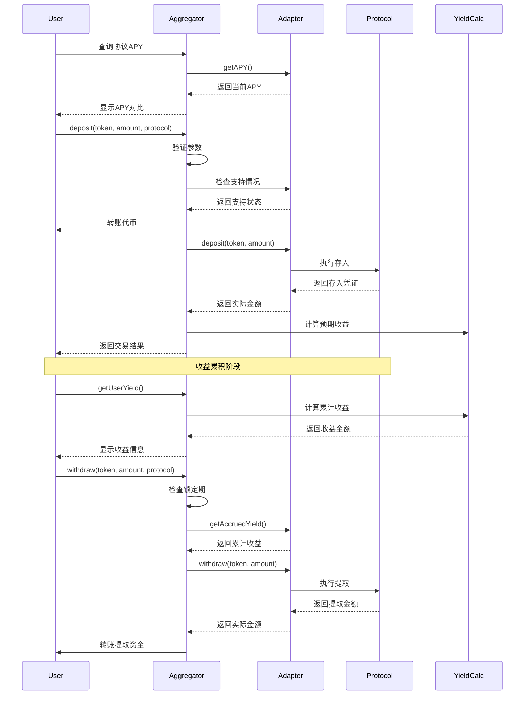

# DeFi Aggregator - 智能合约项目

## 项目概述

DeFi Aggregator 是一个去中心化金融聚合器智能合约平台，允许用户将资金存入多个DeFi协议（AAVE、Uniswap、Compound、Curve）来获取收益。项目采用适配器模式，统一不同协议的接口，为用户提供简单的一站式DeFi收益管理服务。

## 核心功能

- 🏦 **多协议支持**：集成AAVE、Uniswap、Compound、Curve等主流DeFi协议
- 💰 **收益聚合**：自动选择最优收益率策略
- 🔒 **锁定期管理**：支持不同协议的锁定期要求
- 📊 **实时监控**：实时查看投资状态和收益情况
- 🛡️ **安全机制**：多重安全保护，防止重入攻击和滑点风险

## 项目架构

### 系统架构图


### 合约架构
```
src/
├── DeFiAggregator.sol          # 主聚合器合约
├── interfaces/
│   ├── IDeFiAggregator.sol    # 主合约接口
│   └── IProtocolAdapter.sol    # 协议适配器接口
├── adapters/
│   ├── AaveAdapter.sol        # AAVE协议适配器
│   ├── UniswapAdapter.sol     # Uniswap协议适配器
│   ├── CompoundAdapter.sol    # Compound协议适配器
│   └── CurveAdapter.sol       # Curve协议适配器
└── libraries/
    ├── YieldCalculator.sol    # 收益计算库
    ├── LockManager.sol        # 锁定期管理库
    ├── ErrorsLib.sol          # 错误定义库
    └── EventsLib.sol          # 事件定义库
```

### 用户交互时序图


## 技术栈

- **智能合约语言**：Solidity ^0.8.19
- **开发框架**：Hardhat
- **测试框架**：Hardhat Network + Chai
- **代码质量**：Solhint + Prettier
- **依赖管理**：npm
- **区块链网络**：Ethereum、Polygon、Arbitrum

## 安装和配置

### 环境要求
```bash
node >= 16.0.0
npm >= 7.0.0
```

### 安装依赖
```bash
npm install
```

### 环境配置
复制 `.env.example` 为 `.env` 并配置相关参数：
```bash
# 区块链网络配置
MAINNET_URL=https://mainnet.infura.io/v3/YOUR_PROJECT_ID
POLYGON_URL=https://polygon-mainnet.g.alchemy.com/v2/YOUR_API_KEY
ARBITRUM_URL=https://arb1.arbitrum.io/rpc

# 私钥（用于部署）
PRIVATE_KEY=your_private_key_here

# Etherscan API（用于合约验证）
ETHERSCAN_API_KEY=your_etherscan_api_key
```

## 合约部署

### 1. 编译合约
```bash
npx hardhat compile
```

### 2. 运行测试
```bash
npx hardhat test
```

### 3. 部署到本地网络
```bash
npx hardhat node
npx hardhat run scripts/deploy.js --network localhost
```

### 4. 部署到主网
```bash
# 部署到Ethereum主网
npx hardhat run scripts/deploy.js --network mainnet

# 部署到Polygon
npx hardhat run scripts/deploy.js --network polygon

# 部署到Arbitrum
npx hardhat run scripts/deploy.js --network arbitrum
```

## 协议适配器配置

### AAVE适配器配置
```javascript
// 在部署脚本中配置
const aavePoolAddresses = {
  mainnet: "0x87870Bca3F3fD6335C3F4ce8392D69350B4fA4E2",
  polygon: "0x794a61358D6845594F94dc1DB02A252b5b4814aD",
  arbitrum: "0x794a61358D6845594F94dc1DB02A252b5b4814aD"
};

// 支持的代币和对应的aToken
const aaveTokens = {
  USDC: {
    token: "0xA0b86991c6218b36c1d19D4a2e9Eb0cE3606eB48",
    aToken: "0x98C23E9d8f34FEFb1B7BD6a91B7FF5F3EA0B6DE8"
  },
  USDT: {
    token: "0xdAC17F958D2ee523a2206206994597C13D831ec7",
    aToken: "0x23878914EFE38d27C4D67Ab6ed1A38E37EB8658a"
  },
  DAI: {
    token: "0x6B175474E89094C44Da98b954EedeAC495271d0F",
    aToken: "0x018008bfb33d285247A21d44E50697654f754e63"
  }
};
```

### Compound适配器配置
```javascript
const compoundComptroller = {
  mainnet: "0x3d9819210A31b4961b30EF54bE2aeD79B9c9Cd3B",
  polygon: "0xae4b41b2f5476b6e6b1d4d7c4d0c8e8f2c4e8b1f",
  arbitrum: "0xbada459451a24b98b473a63a0b38d0d0c7ec73b5"
};
```

## 使用示例

### 1. 存入资金
```javascript
// 连接钱包
const provider = new ethers.providers.Web3Provider(window.ethereum);
const signer = provider.getSigner();

// 获取合约实例
const aggregator = new ethers.Contract(aggregatorAddress, aggregatorABI, signer);

// 存入USDC到AAVE
const tokenAmount = ethers.utils.parseUnits("1000", 6); // 1000 USDC
const tx = await aggregator.deposit(
  usdcAddress,
  tokenAmount,
  "AAVE"
);

await tx.wait();
console.log("存款成功！");
```

### 2. 查询收益
```javascript
// 查询用户在AAVE中的USDC收益
const yield = await aggregator.getUserYield(
  userAddress,
  usdcAddress,
  "AAVE"
);

console.log(`累计收益: ${ethers.utils.formatUnits(yield, 6)} USDC`);
```

### 3. 提取资金
```javascript
// 提取资金（考虑锁定期）
const withdrawAmount = ethers.utils.parseUnits("500", 6); // 提取500 USDC

// 检查可提取金额
const withdrawable = await aggregator.getWithdrawableAmount(
  userAddress,
  usdcAddress,
  "AAVE"
);

if (withdrawable.gte(withdrawAmount)) {
  const tx = await aggregator.withdraw(
    usdcAddress,
    withdrawAmount,
    "AAVE"
  );
  
  await tx.wait();
  console.log("提取成功！");
}
```

## 安全考虑

### 1. 重入保护
- 所有外部调用都使用ReentrancyGuard
- 采用检查-生效-交互模式

### 2. 滑点保护
- 设置最大滑点限制
- 使用实际返回金额而非预期金额

### 3. 权限控制
- 管理员权限分级管理
- 支持紧急暂停功能

### 4. 审计和测试
- 完整的单元测试覆盖
- 集成测试验证协议交互
- 安全审计检查清单

## 性能优化

### 1. Gas优化
- 使用映射而非数组进行频繁查找
- 批量操作减少交易数量
- 优化存储布局减少存储操作

### 2. 收益计算优化
- 使用高精度数学库
- 缓存APY数据减少外部调用
- 批量更新用户收益状态

## 监控和维护

### 1. 链上监控
- 监控协议APY变化
- 跟踪异常大额提取
- 检测智能合约异常

### 2. 数据指标
- 总锁仓量（TVL）
- 用户数量和活跃度
- 协议收益率对比
- 手续费收入统计
