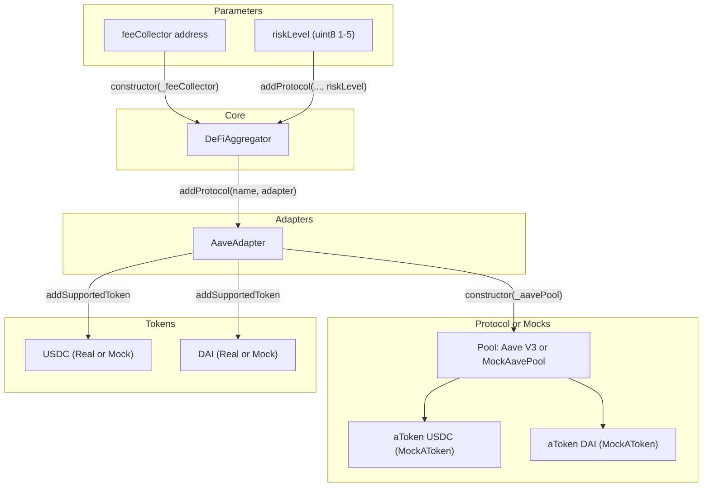

# DeFi Aggregator 合约依赖图

```mermaid
graph TD
  subgraph Core
    AGG["DeFiAggregator"]
  end

  subgraph Adapters
    AAVE["AaveAdapter"]
  end

  subgraph "Protocol or Mocks"
    POOL["Pool: Aave V3 or MockAavePool"]
    aUSDC["aToken USDC (MockAToken)"]
    aDAI["aToken DAI (MockAToken)"]
  end

  subgraph Tokens
    USDC["USDC (Real or Mock)"]
    DAI["DAI (Real or Mock)"]
  end

  subgraph Parameters
    FEE["feeCollector address"]
    RISK["riskLevel (uint8 1-5)"]
  end

  AGG -- addProtocol(name, adapter) --> AAVE
  AAVE -- constructor(_aavePool) --> POOL
  AAVE -- addSupportedToken --> USDC
  AAVE -- addSupportedToken --> DAI
  POOL --> aUSDC
  POOL --> aDAI

  FEE -- constructor(_feeCollector) --> AGG
  RISK -- addProtocol(..., riskLevel) --> AGG
```
 