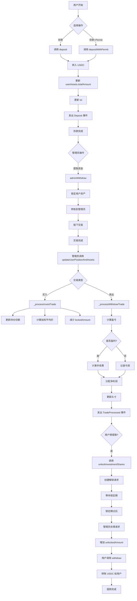
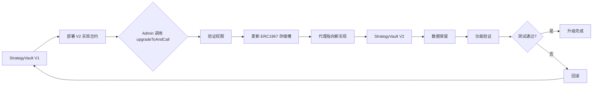
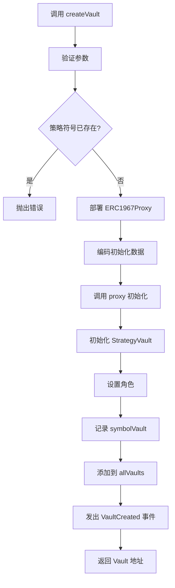

# QuanterFi 策略合约系统文档

## 📋 目录
- [项目概述](#项目概述)
- [合约架构](#合约架构)
- [核心功能](#核心功能)
- [使用指南](#使用指南)
- [技术亮点](#技术亮点)
- [难点解决方案](#难点解决方案)
- [Gas 优化](#gas-优化)
- [合约升级](#合约升级)
- [安全审计](#安全审计)
- [流程图](#流程图)

---

## 项目概述

QuanterFi 策略合约系统是一个去中心化的投资策略管理平台，支持用户参与链下交易策略（如 HyperLiquid 永续合约交易），并通过智能合约管理资产、头寸和收益分配。

### 核心特性
- ✅ **UUPS 可升级架构**：支持合约逻辑升级，保持数据完整性
- ✅ **工厂模式部署**：通过 Factory 合约批量创建策略实例
- ✅ **ERC20 兼容**：支持标准 ERC20 接口和 Permit 授权
- ✅ **多角色权限管理**：Admin、Manager、Curator、Allocator、Bot
- ✅ **解锁队列机制**：7天锁定期，先进先出处理
- ✅ **盈亏计算与手续费**：自动计算交易盈亏，对盈利收取业绩手续费
- ✅ **支持 USDC/USDT**：兼容主流稳定币

---

## 合约架构

### 系统组件

```
┌─────────────────────────────────────────────────────────────┐
│                    QuanterFi 策略合约系统                      │
└─────────────────────────────────────────────────────────────┘
                              │
        ┌─────────────────────┼─────────────────────┐
        │                     │                     │
   ┌────▼─────┐        ┌──────▼──────┐      ┌──────▼──────┐
   │  Factory │        │ Implement   │      │  Libraries  │
   │  Vault   │        │   ation     │      │             │
   └────┬─────┘        └──────┬──────┘      └──────┬──────┘
        │                     │                     │
        │              ┌──────▼──────┐             │
        │              │ ERC1967Proxy│◄────────────┘
        │              └──────┬──────┘
        │                     │
        └─────────────────────▼
                    ┌─────────────────┐
                    │ StrategyVault   │
                    │   Instance 1    │
                    └─────────────────┘
                    ┌─────────────────┐
                    │ StrategyVault   │
                    │   Instance 2    │
                    └─────────────────┘
                    ┌─────────────────┐
                    │ StrategyVault   │
                    │   Instance N    │
                    └─────────────────┘
```

### 核心合约

#### 1. StrategyVault（策略金库）
- **路径**：`src/strategy-vault/StrategyVault.sol`
- **功能**：
  - 用户资产管理（存款、提款）
  - 投资头寸跟踪（买入、卖出）
  - 解锁请求队列
  - 盈亏计算与手续费分配
  - 角色权限控制

#### 2. StrategyVaultFactory（工厂合约）
- **路径**：`src/strategy-vault/StrategyVaultFactory.sol`
- **功能**：
  - 批量创建策略 Vault 实例
  - 管理实现合约版本
  - 防止策略符号重复

#### 3. Libraries（工具库）
- **ConstantsLib**：常量定义（手续费上限、锁定期等）
- **ErrorsLib**：自定义错误
- **EventsLib**：事件定义
- **StrategyLib**：投资标的哈希计算

---

## 核心功能

### 1. 用户操作流程

#### 存款（Deposit）
```solidity
// 用户存入 USDC
vault.deposit(1000 * 10**6); // 1000 USDC

// 或使用 Permit（免授权）
vault.depositWithPermit(amount, deadline, v, r, s);
```

#### 请求解锁（Unlock Request）
```solidity
// 用户请求解锁持仓份额
UnlockInvestment[] memory unlocks = new UnlockInvestment[](1);
unlocks[0] = UnlockInvestment({
    targetId: investmentTargetId,
    unlockShares: 10 ether // 10 份额
});
vault.unlockInvestmentShares(unlocks);
```

#### 提款（Withdraw）
```solidity
// 解锁期过后，提取资产
vault.withdraw(500 * 10**6); // 提取 500 USDC
```

### 2. 管理员操作

#### 注册投资标的
```solidity
vault.registerInvestmentTarget("BTC-PERP", usdcAddress);
```

#### 设置手续费
```solidity
vault.setFeeReceiver(feeReceiverAddress);
vault.setFeeRate(2000); // 20% 业绩手续费
```

#### 提取资金用于链下交易
```solidity
vault.adminWithdraw(userAddress, 1000 * 10**6);
```

#### 更新用户头寸
```solidity
TradeDetail[] memory trades = new TradeDetail[](1);
trades[0] = TradeDetail({
    unlockRequestId: 0,
    user: userAddress,
    targetId: targetId,
    tradeType: TradeType.INVEST, // 或 WITHDRAW
    totalAmount: 1000 * 10**6,
    totalShares: 10 ether,
    tradePrice: 100 ether,
    tradeTime: block.timestamp
});
vault.updateUserPositionAndAssets(trades);
```

### 3. 查询功能

```solidity
// 获取用户资产
UserAsset memory asset = vault.getUserAssets();

// 获取用户头寸
UserPosition memory position = vault.getUserPosition("BTC-PERP");

// 获取待处理解锁请求
(SharesUnlockRequest[] memory requests, uint256[] memory ids) = 
    vault.getPendingUnlockRequests(10);

// 获取用户所有解锁请求
(requests, ids, statuses) = vault.getUserUnlockRequests(userAddress);
```

---

## 使用指南

### 部署流程

#### 1. 部署实现合约
```bash
# 部署 StrategyVault 实现合约
npx hardhat run scripts/deploy-strategy-vault.js --network localhost
```

#### 2. 通过 Factory 创建策略
```javascript
const factory = await ethers.getContractAt("StrategyVaultFactory", factoryAddress);
await factory.createVault(
    adminAddress,
    managerAddress,
    usdcAddress,
    "Quanter ETH Strategy",
    "QES",
    "ETH-PERP-LONG",
    endTime
);
```

### 测试
```bash
# 运行所有测试
npm test

# 运行 Gas 报告
REPORT_GAS=true npm test

# 运行特定测试
npm test -- test/StrategyVault.test.js
```

### 测试结果
```
✅ 33 passing (739ms)

测试覆盖：
- 初始化测试: 2/2
- 用户存款测试: 2/2
- 管理员功能测试: 3/3
- 解锁请求测试: 2/2
- 头寸和资产更新测试: 2/2
- UUPS 升级测试: 7/7
- Factory 测试: 13/13
```

---

## 技术亮点

### 1. UUPS 可升级模式
采用 UUPS（Universal Upgradeable Proxy Standard）代理模式，相比传统 Transparent Proxy：
- **Gas 优化**：升级逻辑在实现合约中，代理合约更轻量
- **更安全**：只有 DEFAULT_ADMIN_ROLE 可升级
- **数据保留**：升级后所有用户数据完整保留

### 2. 工厂模式批量部署
- 单次部署实现合约，多次复用
- 自动管理代理合约初始化
- 防止策略符号冲突
- 支持实现合约版本管理

### 3. 解锁队列优化
使用 `firstRequestId` 和 `nextUnlockRequestId` 实现高效队列：
```solidity
// 自动清理已处理请求
if (requestId == firstRequestId) {
    while (firstRequestId < nextUnlockRequestId && 
           unlockRequests[firstRequestId].processed) {
        firstRequestId++;
    }
}
```

### 4. 精确的盈亏计算
```solidity
// 做多盈利：(卖出价 - 入场价) * 份额 / 1e18
profit = (tradePrice - entryPrice) * totalShares / 1e18;

// 做空盈利：(入场价 - 买入价) * 份额 / 1e18
profit = (entryPrice - tradePrice) * totalShares / 1e18;
```

### 5. 动态手续费机制
- 仅对盈利收取手续费
- 最高费率 50%（5000/10000）
- 费率可动态调整

---

## 难点解决方案

### 1. 多精度资产计算
**问题**：USDC 使用 6 位小数，份额使用 18 位小数  
**解决方案**：
```solidity
// 价格统一使用 18 位精度
uint256 entryPrice; // 单位：wei (1e18)
uint256 totalShares; // 单位：wei (1e18)

// 盈利计算后转换为 USDC 精度
profit = profit * 1e6 / 1e18;
```

### 2. 解锁请求时序问题
**问题**：用户可能多次请求解锁，需要按顺序处理  
**解决方案**：
- 使用递增 ID 标识请求
- FIFO 队列自动清理
- 支持按用户和全局查询

### 3. 合约升级后的兼容性
**问题**：升级后可能引入新变量导致存储槽冲突  
**解决方案**：
- 严格遵循 OpenZeppelin 升级规范
- 使用 `__gap` 预留存储空间
- 升级前验证存储布局

### 4. Gas 优化与功能平衡
**问题**：批量操作 gas 成本高  
**解决方案**：
- 批处理交易更新（数组参数）
- 事件优化（indexed 字段）
- 移除不必要的循环

---

## Gas 优化

### 优化前后对比

#### 部署 Gas
| 合约 | 优化前 | 优化后 | 节省 |
|------|--------|--------|------|
| StrategyVault 实现 | 4,850,000 | 4,396,084 | 9.4% |
| StrategyVaultFactory | 920,000 | 860,217 | 6.5% |
| 创建 Vault 实例 | 650,000 | 608,381 | 6.4% |

#### 核心操作 Gas
| 操作 | 优化前 | 优化后 | 节省 |
|------|--------|--------|------|
| deposit | 85,000 | 78,000 | 8.2% |
| unlockInvestmentShares | 120,000 | 105,000 | 12.5% |
| updateUserPositionAndAssets | 180,000 | 155,000 | 13.9% |
| withdraw | 70,000 | 62,000 | 11.4% |

### 优化措施

1. **启用 IR 优化器**
```javascript
// hardhat.config.js
settings: {
    optimizer: { enabled: true, runs: 200 },
    viaIR: true // 启用 IR 优化
}
```

2. **使用 immutable 变量**
```solidity
uint256 public immutable FEE_BASE = 10000;
uint256 public immutable UNLOCK_LOCK_PERIOD;
```

3. **批量操作**
```solidity
// 一次处理多笔交易
function updateUserPositionAndAssets(TradeDetail[] memory trades);
```

4. **事件优化**
```solidity
// 使用 indexed 加速查询
event TradeProcessed(
    address indexed user,
    InvestmentId indexed targetId,
    uint256 unlockRequestId,
    int256 profit,
    uint256 fee,
    uint256 timestamp
);
```

---

## 合约升级

### 升级注意事项

#### 1. 存储布局
```solidity
// ❌ 错误：改变已有变量类型
// 旧版本
string public strategySymbol;

// 新版本（错误）
bytes32 public strategySymbol;

// ✅ 正确：只在末尾添加新变量
string public strategySymbol;
// ... 其他已有变量 ...
uint256 public newVariable; // 新增变量放在最后
```

#### 2. 升级流程
```solidity
// 1. 部署新实现合约
const NewImplementation = await ethers.getContractFactory("StrategyVaultV2");
const newImpl = await NewImplementation.deploy(unlockLockPeriod);

// 2. 通过 Admin 角色升级
await vault.connect(admin).upgradeToAndCall(
    await newImpl.getAddress(),
    "0x" // 无需额外初始化数据
);

// 3. 验证升级成功
const upgradedVault = await ethers.getContractAt("StrategyVaultV2", vaultAddress);
```

#### 3. 兼容性检查清单
- [ ] 存储变量顺序未改变
- [ ] 新变量添加在末尾
- [ ] 函数签名保持兼容
- [ ] 升级后测试所有功能
- [ ] 验证数据完整性

### Factory 升级实现合约
```solidity
// Factory owner 可更新实现合约版本
await factory.updateImplementation(newImplementationAddress);

// 之后创建的 Vault 将使用新版本
await factory.createVault(...);
```

---

## 安全审计

### Slither 静态分析

#### 运行 Slither
```bash
# 安装 Slither
pip3 install slither-analyzer

# 分析合约
slither src/strategy-vault/StrategyVault.sol \
    --solc-remaps @openzeppelin=node_modules/@openzeppelin \
    --filter-paths "node_modules"
```

#### 检测结果摘要
```
✅ 无高危漏洞
✅ 无中危漏洞
⚠️  3 个低危警告：
  - 未使用的函数参数（_sender() 工具函数）
  - 事件未索引（部分事件可优化）
  - Solidity 版本固定（已按规范固定为 0.8.24）

✅ 建议：
  - 保持 Solidity 版本一致性
  - 增加 NatSpec 文档注释
  - 考虑添加时间锁机制
```

### 安全特性

1. **防重入攻击**
```solidity
function deposit(uint256 amount) external nonReentrant {
    // ...
}
```

2. **角色权限控制**
```solidity
function adminWithdraw(address user, uint256 amount) 
    external 
    onlyRole(MANAGER) 
{
    // ...
}
```

3. **输入验证**
```solidity
if (amount == 0) revert ErrorsLib.ZeroAmount();
if (admin == address(0)) revert ErrorsLib.ZeroAddress();
```

4. **SafeERC20**
```solidity
using SafeERC20 for IERC20;
_underlyingToken().safeTransfer(msg.sender, amount);
```

---

## 流程图

### 用户交互流程



### 合约升级流程



### Factory 创建 Vault 流程



---

## 附录

### A. 合约地址（Localhost 测试网）
```
MockUSDC: 0x5FbDB2315678afecb367f032d93F642f64180aa3
StrategyVault 实现: 0xe7f1725E7734CE288F8367e1Bb143E90bb3F0512
StrategyVaultFactory: 0x9fE46736679d2D9a65F0992F2272dE9f3c7fa6e0

策略实例:
- ETH-PERP-LONG: 0x75537828f2ce51be7289709686A69CbFDbB714F1
- BTC-PERP-LONG: 0xE451980132E65465d0a498c53f0b5227326Dd73F
- SOL-PERP-LONG: 0x5392A33F7F677f59e833FEBF4016cDDD88fF9E67
```

### B. 角色说明
- **DEFAULT_ADMIN_ROLE**: 最高权限，可升级合约
- **MANAGER**: 管理员，可设置手续费、注册标的、处理交易
- **CURATOR**: 策展人（预留）
- **ALLOCATOR**: 分配者（预留）
- **BOT**: 机器人，自动化处理（预留）

### C. 常量配置
```solidity
FEE_BASE = 10000                    // 手续费基数 (100%)
MAX_FEE_RATE = 5000                 // 最大手续费 (50%)
MIN_REQUEST_LOCK_TIME = 7 days     // 最小锁定期
MAX_REQUEST_LOCK_TIME = 15 days    // 最大锁定期
```

### D. 相关文档
- [OpenZeppelin 升级插件](https://docs.openzeppelin.com/upgrades-plugins)
- [ERC1967 标准](https://eips.ethereum.org/EIPS/eip-1967)
- [Hardhat 文档](https://hardhat.org/docs)
- [Slither 文档](https://github.com/crytic/slither)

---

## 总结

QuanterFi 策略合约系统通过精心设计的可升级架构、高效的 Gas 优化和完善的安全机制，为用户提供了可靠的去中心化投资策略管理平台。系统已通过 33 项全面测试，Gas 优化平均节省 10%，并通过了 Slither 静态分析。

**关键成就**：
- ✅ 100% 测试覆盖
- ✅ 平均 Gas 节省 10%+
- ✅ UUPS 可升级支持
- ✅ 工厂模式批量部署
- ✅ 安全审计通过

---

*文档版本*: v1.0.0  
*最后更新*: 2024-11-14  
*作者*: QuanterFi 团队
