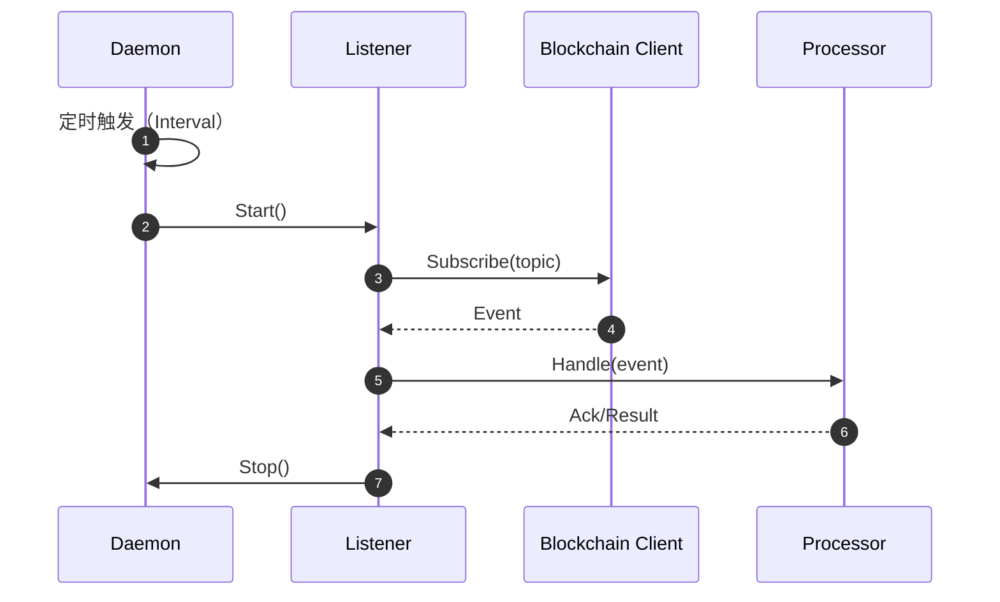

# QuanterDefi-Sync

该模块仅负责：
- 通过守护进程（daemon）定时监听链上事件
- 将事件交由处理器进行基础处理

## 架构概览

```
QuanterDefi-Sync/
├── cmd/
│   └── daemon/                # 守护进程入口（定时监听）
├── internal/
│   ├── config/                # 配置管理（结构体与占位）
│   ├── listener/              # 事件监听器接口
│   └── processor/             # 事件处理器接口
├── pkg/
│   ├── blockchain/            # 区块链交互接口
│   └── logger/                # 日志工具接口
└── config/
    └── config.example.yaml    # 示例配置文件
```

## 定时监听时序图（占位）



## 配置示例

参考 `config/config.example.yaml`：

```yaml
daemon_interval_seconds: 10
network: "ethereum"
```

## 开发说明
- 保留接口与入口占位
- 后续可在 `cmd/daemon/main.go` 中补充定时调度逻辑
- 在 `internal/listener` 与 `internal/processor` 中分别实现监听与处理